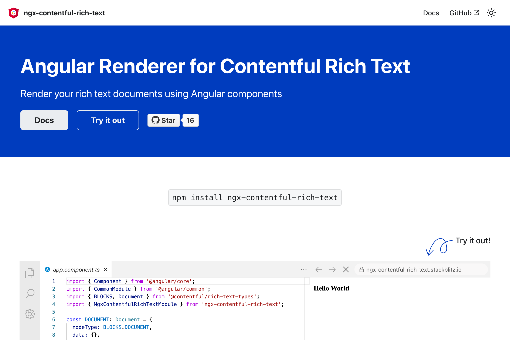

import { BrowserWindow } from "@site/src/components/BrowserWindow";

Documentation site for a library to render the [Contentful Rich Text](https://www.contentful.com/developers/docs/javascript/tutorials/rendering-contentful-rich-text-with-javascript/) field using Angular components.

<BrowserWindow url="https://kgajera.github.io/ngx-contentful-rich-text">

</BrowserWindow>

<!--truncate-->

Also see:
- `ngx-contentful-rich-text` on [GitHub](https://github.com/kgajera/ngx-contentful-rich-text)
- `ngx-contentful-rich-text` on [NPM](https://www.npmjs.com/package/ngx-contentful-rich-text)
