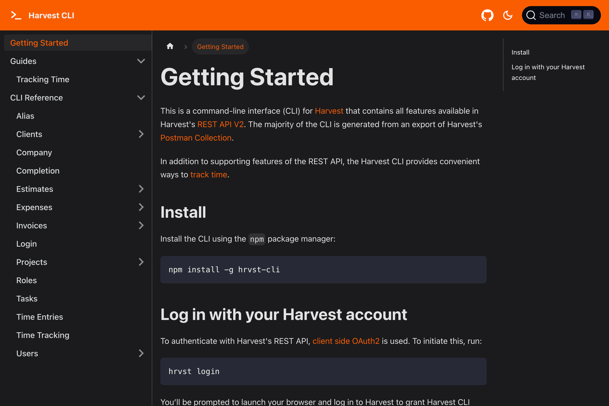

import { BrowserWindow } from "@site/src/components/BrowserWindow";

Documentation site for a command-line interface (CLI) for Harvest, a time tracking software.

<BrowserWindow url="https://kgajera.github.io/hrvst-cli">

</BrowserWindow>

<!--truncate-->

Also see:
- `hrvst-cli` on [Harvest](https://www.getharvest.com/integrations/hrvst-cli)
- `hrvst-cli` on [GitHub](https://github.com/kgajera/hrvst-cli)
- `hrvst-cli` on [NPM](https://www.npmjs.com/package/hrvst-cli)
