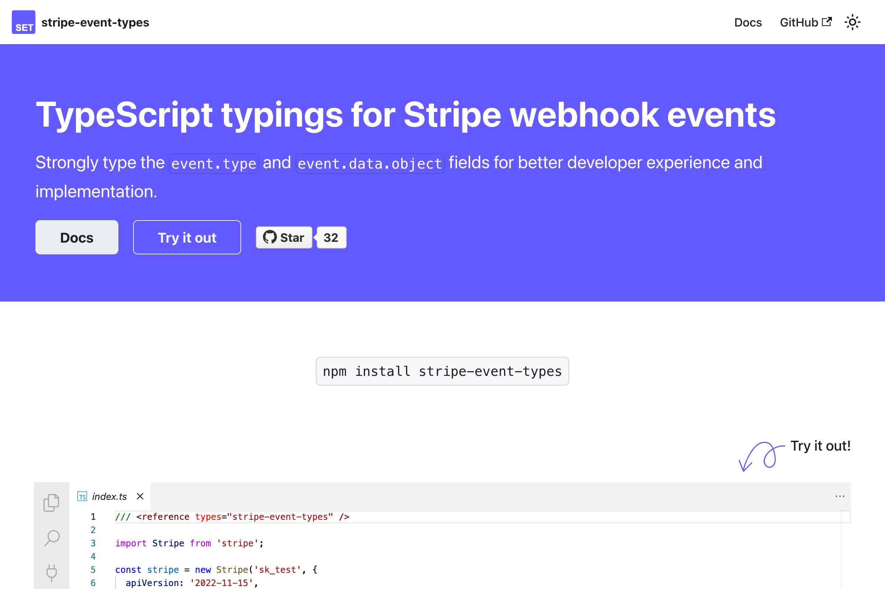

import BrowserWindow from "@site/src/components/BrowserWindow";

Documentation site for the [`stripe-event-types`](https://github.com/kgajera/stripe-event-types) library that makes implementing Stripe webhook handlers type-safe.

<BrowserWindow url="https://kgajera.github.io/stripe-event-types">

</BrowserWindow>

<!--truncate-->
