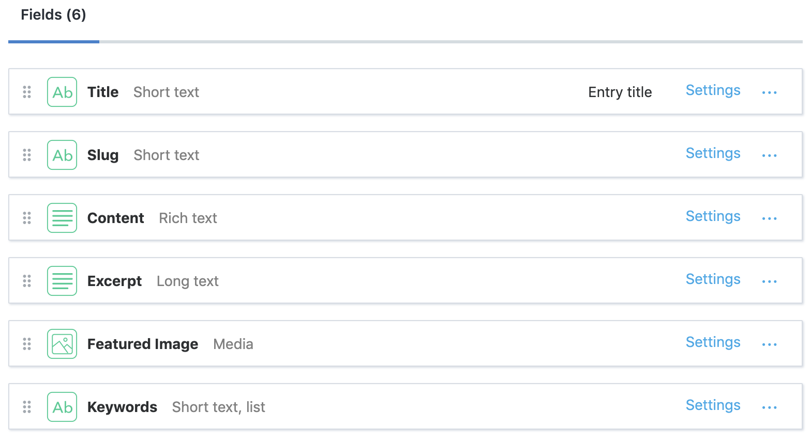
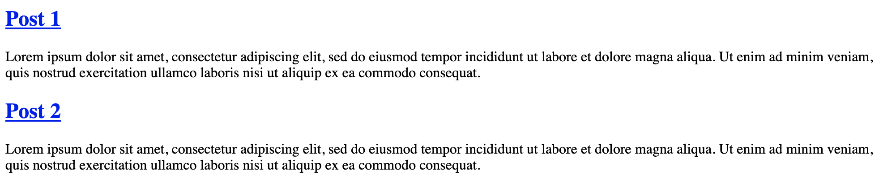
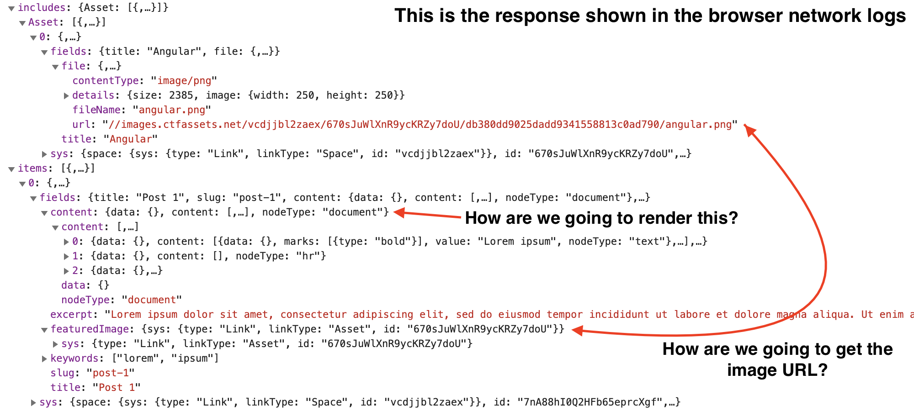
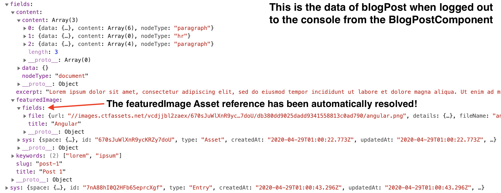
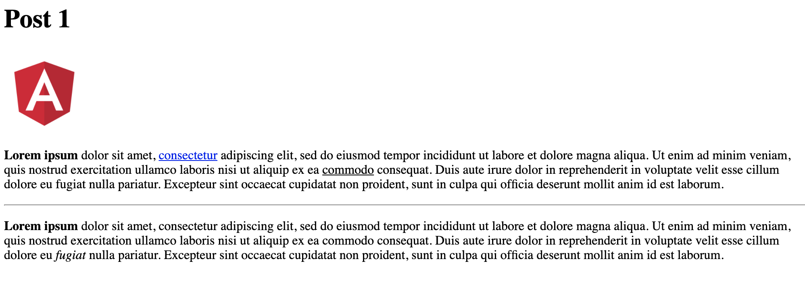
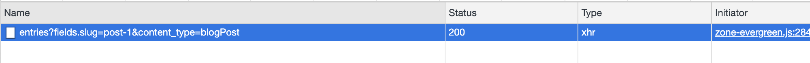
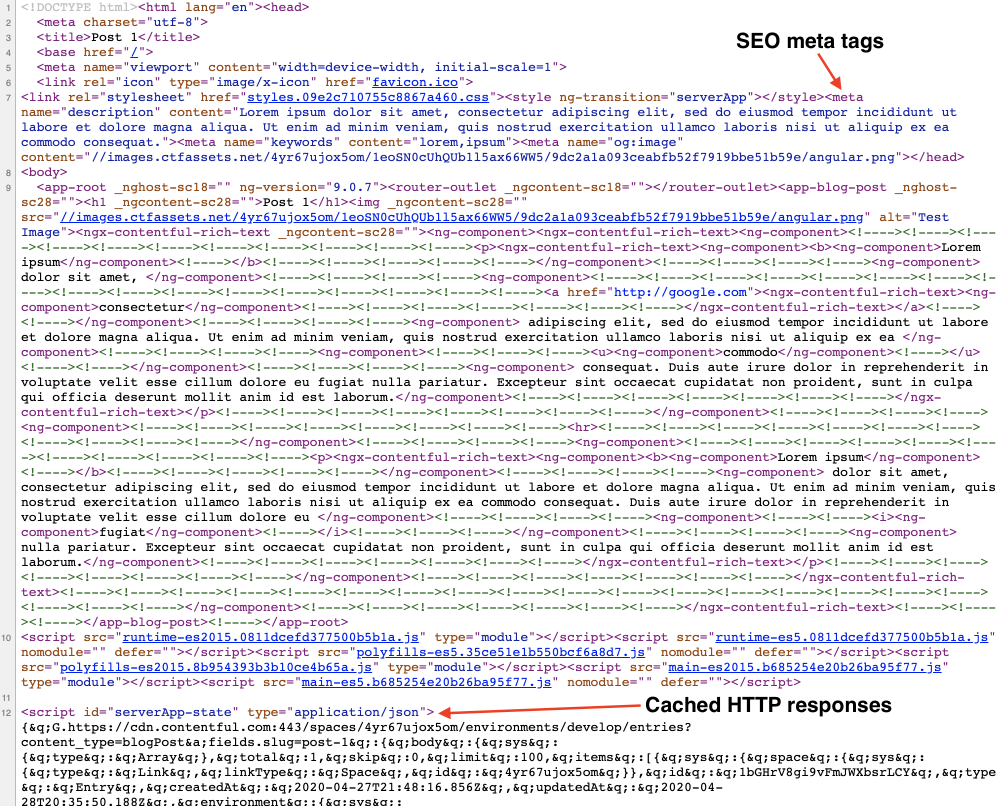

[Contentful](https://www.contentful.com) is a headless content management system (CMS) that allows you to manage content and fetch it using their REST or GraphQL API. This makes up your back-end. How the front-end is built is completely up to you! After using [WordPress](https://wordpress.org) for the past decade, this approach feels refreshing because I can use modern technology stacks that provide better user experiences. In this post, I'll explain how blog posts can be managed in Contentful, and then implement an [Angular](https://angular.io) front-end to consume and display them.

<!--truncate-->

Throughout this post, it's assumed that you have some familiarity with Angular and I'll be referencing the Angular CLI commands used to generate the necessary files. For brevity, I'll skip over some details such as module imports and routing configuration. Please refer to the full source code linked below to fill in those gaps.

The final source code that this post is based on is located in this repo: https://github.com/kgajera/javascript-examples/tree/master/examples/angular-contentful-blog

## Create a new Angular project

To get started, let's start fresh with a new Angular project:

```
ng new angular-contentful-blog
```

And install Contentful's SDK:

```
npm install --save contentful
```

## Create content models in Contentful

Before we can start creating content, we first need to define our Content Models. If you're coming from a WordPress background, you can think of these as post types that we will be registering. These models will define the types of content we will be able to create and the fields necessary to collect the expected data in the format we want.

For this example, I will use the following content model to represent a blog post:



Let's also create an interface representing this content type, `ng generate interface contentful/blog-post`:

```ts title="/src/app/contentful/blog-post.ts"
import { Asset } from "contentful";

/**
 * This model represents our Blog Post content type in Contentful and
 * the expected response type from their API. Each property
 * in this model corresponds to a "name" of a field in our Blog Post
 * content type.
 */
export interface BlogPost {
  title: string;
  slug: string;
  content: string;
  excerpt: string;
  featuredImage: Asset;
  keywords: Array<string>;
}
```

## Integrate Contentful into Angular project

Grab your Space ID and Content Delivery API access token from Contentful and add them to your environment file. These two values are required and will be used to make authenticated API requests.

```ts title="/src/environments/environment.ts"
export const environment = {
  production: false,
  // Contentful API authentication credentials
  contentful: {
    space: "vcdjjbl2zaex",
    accessToken: "xG-Ei5PrA5Dz-dr7kaKwSUMHe0UGXUzP690e4QGtSbE",
  },
};
```

Let's create a new service, `ng generate service contentful/contentful-api`. This service will initialize the `ContentfulClientApi` which can then be used to fetch data from Contentful via their REST API. The two client methods of interest are the `getEntry` and `getEntries` methods to retrieve a single and listing of entries respectively.

We'll implement the `getBlogPosts` method to get all our blog posts using the getEntries method.

We'll implement the `getBlogPost` method to get a single blog post using the getEntries method. Yeah, you read that right. We're not using the getEntry method because we will be finding the blog post by the slug field instead of its id. The reason for using the slug is so our route paths will be SEO friendly.

```ts title="/src/app/contentful/contentful-api.service.ts"
import { Injectable } from "@angular/core";
import {
  ContentfulClientApi,
  Entry,
  EntryCollection,
  createClient,
} from "contentful";

import { environment } from "../../environments/environment";
import { BlogPost } from "./blog-post";

@Injectable({
  providedIn: "root",
})
export class ContentfulApiService {
  private clientApi: ContentfulClientApi;

  constructor() {
    this.clientApi = createClient({
      space: environment.contentful.space,
      accessToken: environment.contentful.accessToken,
    });
  }

  /**
   * Get a single blog post by its slug
   *
   * @param slug The slug for the blog post
   */
  getBlogPost(slug: string): Promise<Entry<BlogPost>> {
    return this.getBlogPosts({
      "fields.slug": slug,
    }).then((response) => response.items[0]);
  }

  /**
   * Get listing of all blog posts
   *
   * @param query Filter object
   */
  getBlogPosts(query?: object): Promise<EntryCollection<BlogPost>> {
    return this.clientApi.getEntries<BlogPost>(
      Object.assign({}, query, { content_type: "blogPost" })
    );
  }
}
```

We are now ready to start consuming our content stored in Contentful!

### Create component to list blog posts

We're going to create a component that will list all of our posts: `ng generate component blog-post-list --inlineTemplate=true`

This component will simply call the `getBlogPosts` method to get all our blog posts. We'll then loop through them and display the title and excerpt.

```ts title="/src/app/blog-post-list/blog-post-list.component.ts"
import { Component, OnInit } from "@angular/core";
import { Entry } from "contentful";

import { BlogPost } from "../contentful/blog-post";
import { ContentfulApiService } from "../contentful/contentful-api.service";

@Component({
  selector: "app-blog-post-list",
  template: `
    <article *ngFor="let blogPost of blogPosts">
      <h2>
        <a [routerLink]="blogPost.fields.slug">{{ blogPost.fields.title }}</a>
      </h2>
      <p>{{ blogPost.fields.excerpt }}</p>
    </article>
  `,
  styleUrls: ["./blog-post-list.component.scss"],
})
export class BlogPostListComponent implements OnInit {
  blogPosts: Array<Entry<BlogPost>>;

  constructor(private contentfulApiService: ContentfulApiService) {}

  ngOnInit(): void {
    this.contentfulApiService
      .getBlogPosts()
      .then((blogPosts) => (this.blogPosts = blogPosts.items));
  }
}
```

A more practical implementation should use a paginated approach to retrieve the blog posts. This can be achieved by using the `skip` and `limit` query parameters. For example, our component could be modified to use `this.contentfulApiService.getBlogPosts({ skip: 0, limit: 10 })` to get the first page, `this.contentfulApiService.getBlogPosts({ skip: 10, limit: 10 })` to get the second page, and so on.

This is what our list page looks like:



### Create component to display a single blog post

You may have noticed that the titles on the listing page are links. These are intended to link to a page that will display the full blog post. Let's create the component that will handle this: `ng generate component blog-post --inlineTemplate=true`

Before we look at the implementation of the component, let's take a look at the data we're working with. The first place most developers will go to look at the API response is the browser's network logs (`items[0].fields` is our BlogPost data):



Now, let's look at the implementation of the component so we can go through the above questions.

```ts title="/src/app/blog-post/blog-post.component.ts"
import { Component, OnInit } from "@angular/core";
import { Meta, Title } from "@angular/platform-browser";
import { ActivatedRoute } from "@angular/router";
import { Entry } from "contentful";

import { BlogPost } from "../contentful/blog-post";
import { ContentfulApiService } from "../contentful/contentful-api.service";

@Component({
  selector: "app-blog-post",
  template: `
    <ng-container *ngIf="blogPost; else loading">
      <h1>{{ blogPost.fields.title }}</h1>
      
      <ngx-contentful-rich-text [document]="blogPost.fields.content">
      </ngx-contentful-rich-text>
    </ng-container>
    <ng-template #loading>Loading...</ng-template>
  `,
  styleUrls: ["./blog-post.component.scss"],
})
export class BlogPostComponent implements OnInit {
  blogPost: Entry<BlogPost>;

  constructor(
    private route: ActivatedRoute,
    private meta: Meta,
    private title: Title,
    private contentfulApiService: ContentfulApiService
  ) {}

  ngOnInit(): void {
    const slug: string = this.route.snapshot.paramMap.get("slug");

    this.contentfulApiService.getBlogPost(slug).then((blogPost) => {
      this.blogPost = blogPost;

      // Set the document title
      this.title.setTitle(blogPost.fields.title);

      // Add meta tags for SEO
      this.meta.addTags([
        {
          name: "description",
          content: blogPost.fields.excerpt,
        },
        {
          name: "keywords",
          content: blogPost.fields.keywords.join(","),
        },
        {
          name: "og:image",
          content: blogPost.fields.featuredImage.fields.file.url,
        },
      ]);
    });
  }
}
```

Our content field is a rich text field type, and you should have noticed the value is represented as a JSON object. This object needs to be parsed and converted into HTML. We are using the `ngx-contentful-rich-text` library for this purpose: `npm install ngx-contentful-rich-text --save`. This library will use Angular components to render the rich text document and you can even configure it to use your own custom renderer components.

It's easy to overlook that Contentful's SDK will automatically resolve fields that contain a reference to an Asset or Entry in the `includes` array! In our example, the `featuredImage` field is a reference to an Asset. To see this in action, let's log out the value to the browser console from the component so we can compare it to the network log data:



Also, note that we are making use of Angular's `Title` and `Meta` services to set the document title and meta tags to make our blog post SEO friendly.

Below is an image of what our blog post page looks like. You can see that the `featuredImage` is displayed and the rich text content field has rendered bold text, links, etc.



## Server-Side Rendering (SSR)

Our site is now able to render content client-side, but in order for search engines to crawl it, we need to render our content server-side. I've encountered many gotchas while implementing SSR for various projects and one specific to Contenful's SDK.

To add SSR to our project, we simply have to run this command: `ng add @nguniversal/express-engine`. In brief, we're now able to run our app on a Node.js Express web server that will compile a HTML page when a request is received. Angular has good documentation on this so I recommend you check that out to learn more: https://angular.io/guide/universal.

The goal of SSR is to render content on the server, therefore, all HTTP requests for our API calls will need to occur server-side instead of client-side. So when we look at browser's network logs, we shouldn't see any activity. However, this behavior won't exist by default so the client will duplicate requests already made on the server. To get the expected behavior, Angular provides the `TransferState` class to allow the server to cache the responses and allow the client to access that cached response.

Import the `TransferHttpCacheModule` from `@nguniversal/common` into your `AppModule`. It's important to note that only responses for requests made through Angular's `HttpClient` will be cached.

And import `ServerTransferStateModule` from `@angular/platform-server` into your `AppServerModule`.

For more details on the modules we just imported, please refer to https://github.com/angular/universal/blob/master/docs/transfer-http.md.

Let's run our app using SSR, `npm run dev:ssr`, and try navigating to our different routes and checking the browser's network logs.



What gives?! The front-end is still making requests. This is because Contentful's SDK uses `axios` to make requests instead of the `HttpClient`. Axios does allow you to provide an adapter meaning we can provide an implementation using the `HttpClient` that conforms to the expected axios return types.

Let's create a new service for the implementation of the adapter: `ng generate service contentful/http-client-axios-adapter`. This implementation is basically a port of their provided adapters.

<details>
<summary>HttpClientAxiosAdapterService</summary>

```ts title="/src/app/contentful/http-client-axios-adapter.service.ts"
import {
  HttpClient,
  HttpErrorResponse,
  HttpResponse,
} from "@angular/common/http";
import { Injectable } from "@angular/core";
import { AxiosError, AxiosRequestConfig, AxiosResponse } from "axios";
import { Observable, throwError } from "rxjs";
import { catchError, map } from "rxjs/operators";

@Injectable({
  providedIn: "root",
})
export class HttpClientAxiosAdapterService {
  constructor(private httpClient: HttpClient) {}

  getAdapter() {
    return <T>(config: AxiosRequestConfig): Promise<AxiosResponse<T>> => {
      const request = this.httpClient.request(
        config.method.toUpperCase(),
        this.buildFullPath(config.baseURL, config.url),
        {
          body: config.data,
          headers: config.headers,
          params: config.params,
          observe: "response",
          withCredentials:
            config.withCredentials !== undefined
              ? !!config.withCredentials
              : undefined,
        }
      );

      return request
        .pipe(
          catchError(
            (response: HttpErrorResponse): Observable<never> =>
              throwError(
                this.createError(
                  response.message,
                  config,
                  response.name,
                  request,
                  response
                )
              )
          ),
          map((response: HttpResponse<T>): AxiosResponse<T> => {
            const validateStatus = config.validateStatus;
            if (
              !response.status ||
              !validateStatus ||
              validateStatus(response.status)
            ) {
              return this.createResponse(config, request, response);
            } else {
              throwError(
                this.createError(
                  `Request failed with status code ${response.status}`,
                  config,
                  null,
                  request,
                  response
                )
              );
            }
          })
        )
        .toPromise<AxiosResponse<T>>();
    };
  }

  /**
   * Creates a new URL by combining the baseURL with the requestedURL,
   * only when the requestedURL is not already an absolute URL.
   * If the requestURL is absolute, this function returns the requestedURL untouched.
   *
   * @param baseURL The base URL
   * @param requestedURL Absolute or relative URL to combine
   * @returns The combined full path
   */
  private buildFullPath(baseURL: string, requestedURL: string) {
    const isAbsoluteUrl: boolean = /^([a-z][a-z\d\+\-\.]*:)?\/\//i.test(
      requestedURL
    );

    if (baseURL && !isAbsoluteUrl) {
      return requestedURL
        ? baseURL.replace(/\/+$/, "") + "/" + requestedURL.replace(/^\/+/, "")
        : baseURL;
    }
    return requestedURL;
  }

  /**
   * Convert to an AxiosError with the specified message, config, error code, request and response.
   *
   * @param message The error message.
   * @param config The config.
   * @param code The error code (for example, 'ECONNABORTED').
   * @param request The request.
   * @param response The response.
   * @returns The created error.
   */
  private createError<T>(
    message: string,
    config: AxiosRequestConfig,
    code?: string,
    request?: Observable<HttpResponse<object>>,
    response?: HttpResponse<T> | HttpErrorResponse
  ): AxiosError<T> {
    const error = new Error(message);
    return this.enhanceError(error, config, code, request, response);
  }

  /**
   * Convert to a AxiosResponse with the specified config, request and response.
   *
   * @param config The config.
   * @param request The request.
   * @param response The response.
   * @returns The created response.
   */
  private createResponse<T>(
    config: AxiosRequestConfig,
    request: Observable<HttpResponse<object>>,
    response: HttpResponse<T> | HttpErrorResponse
  ): AxiosResponse<T> {
    const responseHeaders = response.headers
      .keys()
      .reduce((headersColl, headerKey) => {
        if (response.headers.has(headerKey)) {
          headersColl[headerKey] = response.headers.get(headerKey);
        }
        return headersColl;
      }, {});

    return {
      config,
      data: response instanceof HttpResponse ? response.body : response.error,
      headers: responseHeaders,
      request,
      status: response.status,
      statusText: response.statusText,
    };
  }

  /**
   * Update an Error with the specified config, error code, and response.
   *
   * @param error The error to update.
   * @param config The config.
   * @param code The error code (for example, 'ECONNABORTED').
   * @param request The request.
   * @param response The response.
   * @returns The error.
   */
  private enhanceError<T>(
    error: Error,
    config: AxiosRequestConfig,
    code?: string,
    request?: Observable<HttpResponse<object>>,
    response?: HttpResponse<T> | HttpErrorResponse
  ): AxiosError<T> {
    const axiosError: AxiosError<T> = error as AxiosError;
    axiosError.config = config;
    axiosError.request = request;
    axiosError.response = response
      ? this.createResponse(config, request, response)
      : null;
    axiosError.isAxiosError = true;

    if (code) {
      axiosError.code = code;
    }

    axiosError.toJSON = function () {
      return {
        code: this.code,
        config: this.config,
        name: this.name,
        message: this.message,
      };
    };

    return axiosError;
  }
}
```

</details>

The options object passed to the `createClient` function in the `ContentfulApiService` also needs to be updated to specify our custom adapter by adding this property `adapter: httpClientAxiosAdapter.getAdapter()`.

At last, if we look at the network logs now, there should be no activity. Everything is now working as expected!

And finally, I just want to point out a couple things in the source of the rendered page:



## What's next?

You should now have a good footing as you expand into more content types and in turn, more features in your Angular project. You will also need to figure out how and where you will host this. I'm currently working with a client to build a site using the patterns explained in this post. I hope to share that with you in the coming months.

If you've got questions or ideas for improvements, please share it with us!
