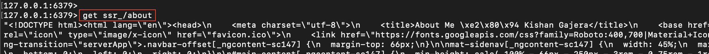
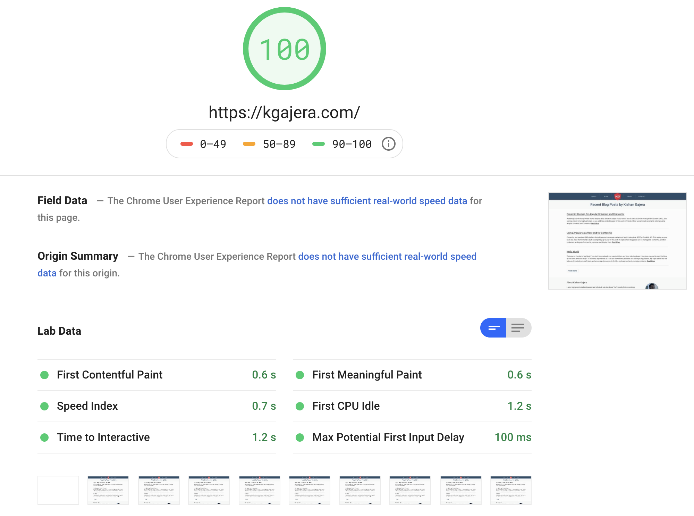

After deploying an Angular SSR app, you might come to notice it takes a few seconds to load the initial page. The time it takes for the Universal engine to render the view is one of many factors that contribute to this delay. Let's see how caching the rendered HTML can improve load times for subsequent requests.

<!--truncate-->

## In-Memory Cache

The easiest approach to caching would be to use a module scoped variable. However, depending on your deployment, this might not work as you expect. For example, if deployed as a serverless function, global variables might not be maintained between invocations. Here's another example, if deployed to distributed servers, each server would have its own separate cache.

To best handle these cases, Redis will be used as a centralized cache. It's known for being lightweight and blazingly fast. To start a Redis instance using Docker, run the following command:

```shell
docker run -d -p 6379:6379 --name ssr-redis redis
```

## Express Server Implementation

The default `server.ts` file generated by Angular Universal just needs a few changes to support caching. Routing in Express is handled by [middleware](https://expressjs.com/en/guide/using-middleware.html#middleware.router) functions that make changes to the request and response objects, and in our case will be used to get and set cache entries.

```ts title="server.ts"
export function app(): express.Application {
  const server = express();
  const distFolder = join(process.cwd(), "dist/browser");
  const indexHtml = existsSync(join(distFolder, "index.original.html"))
    ? "index.original.html"
    : "index";

  // Redis cache client
  const redisClient = redis.createClient();

  // Creates a cache key using the request URL
  const cacheKey: (req: express.Request) => string = (req) =>
    `ssr_${req.originalUrl}`;

  // Universal express-engine
  server.engine(
    "html",
    ngExpressEngine({
      bootstrap: AppServerModule,
    })
  );
  server.set("view engine", "html");
  server.set("views", distFolder);

  // Middleware to send a cached response if one exists
  const cachedResponse: express.RequestHandler = (req, res, next) =>
    redisClient.get(cacheKey(req), (error: Error, reply: string) => {
      if (reply?.length) {
        // Cache exists. Send the response.
        res.send(reply);
      } else {
        // Use the Universal engine to render a response.
        next();
      }
    });

  // Middleware to render a response using the Universal engine
  const universalRenderer: express.RequestHandler = (req, res) => {
    res.render(
      indexHtml,
      {
        req,
        providers: [{ provide: APP_BASE_HREF, useValue: req.baseUrl }],
      },
      (error: Error, html: string) => {
        if (error) {
          return req.next(error);
        }
        if (res.statusCode === 200) {
          // Cache the rendered HTML
          redisClient.set(cacheKey(req), html);
        }
        res.send(html);
      }
    );
  };

  // Serve static files from dist/browser
  server.get(
    "*.*",
    express.static(distFolder, {
      maxAge: "1y",
    })
  );

  // All regular routes use the Universal engine
  server.get("*", cachedResponse, universalRenderer);

  return server;
}
```

The full source code can be viewed here: https://gist.github.com/kgajera/ec250b63efeae833a672dc281cc8af7b

The implementation has two parts:

For each request, first check if a cached version of the rendered HTML exists. If it does, send it as the response, otherwise proceed to the next middleware. This is handled by the `cachedResponse` middleware.
If a cache entry does not exist for the request, the universal engine needs to render, cache, and send the response. This is handled by the `universalRenderer` middleware.
To verify that this works, run the project, `npm run dev:ssr`, and navigate to different pages of your Angular app. All pages should be rendering as normal. Note that the first visit to a page will use the universal engine to render a response and subsequent visits will send the cached version.

Now, let's check the contents of our cache by connecting to the redis-cli program in the Redis container:

```shell
docker exec -it ssr-redis sh -c "redis-cli"`
```

Then, get commands can be run to view cached values. Looking back at the implementation, our cache key is the request URL prefixed by "ssr\_".



## Performance Testing

Did this actually improve performance? We can quantify this using PageSpeed Insights to compare a universal engine rendered page and a cached page. These tests were done on this site (kgajera.com) which is deployed as a serverless function and using a Redis cloud instance.

### Universal Rendered Response

This is the result of the first request without cache present.


### Cached Response

This is the result of the second request using the cached HTML where the time to first byte (TTFB) has really improved.



## Other Considerations

The cache is working, but how do we prevent it from becoming stale when content changes? The right strategy will differ between apps. Reseting the cache could be handled through expiring cache values or triggering from content changes.
