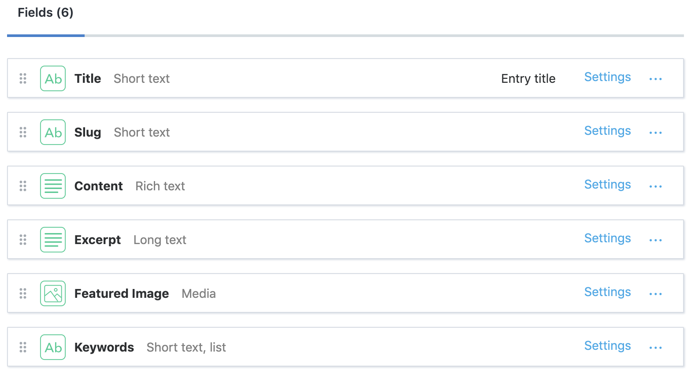
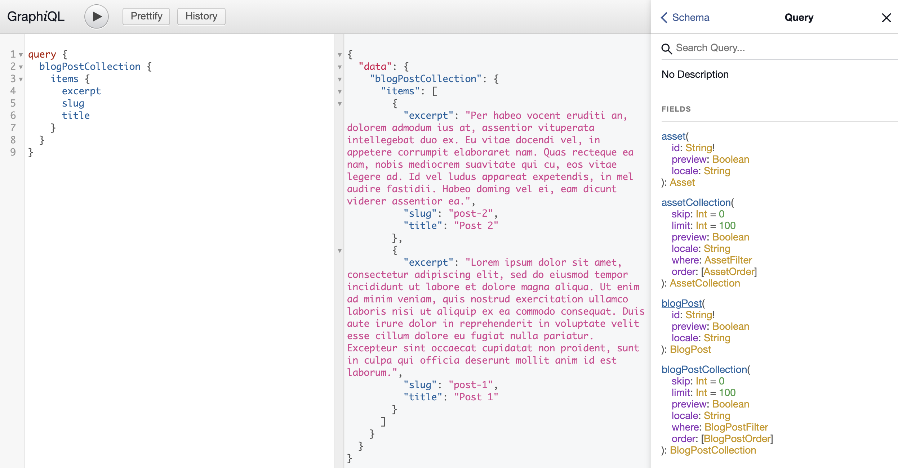
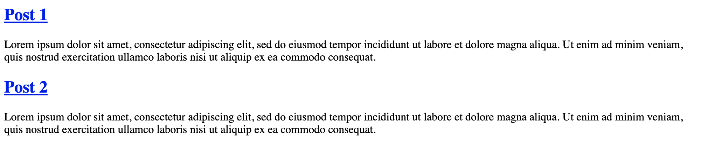
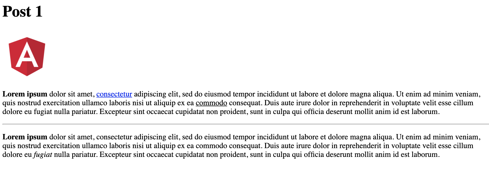

In a [previous post](/blog/using-angular-as-a-front-end-for-contentful), I showed how to integrate [Contentful](https://www.contentful.com) into an Angular project using their REST API. Now that Contentful's GraphQL API is available in the community edition, it should be the preferred way to build your front-end and I'll show you why. This is an example of how to use Contentful to store blog posts, and create a front-end using Angular that will access the data using the GraphQL API. <!--truncate-->We will implement this by doing the following:

- Use the Angular CLI to create the project and generate components
- Use Apollo Angular as our GraphQL client
- Write GraphQL queries
- Generate Typescript typings for our GraphQL queries
- Generate Angular services for our GraphQL queries. We can inject the generated services into our components to fetch data from the API.

The final source code that this post is based on is located in this repo: https://github.com/kgajera/javascript-examples/tree/master/examples/angular-contentful-graphql-blog

## Contentful content model

Before we can start creating content, we first need to define our Content Models. If you're coming from a WordPress background, you can think of these as post types that we will be registering. These models will define the types of content we will be able to create and the fields necessary to collect the expected data in the format we want.

For this example, I will use the following content model to represent a blog post:



After creating the content model, add your space id and access token to the following URL to explore the API using the in-browser GraphQL IDE: `https://graphql.contentful.com/content/v1/spaces/SPACE_ID/explore?access_token=ACCESS_TOKEN`



The GraphiQL interface shown above lets us do the following:

- The rightmost column lets us view the schema. From the root queries, we can drill down into the return types to see what fields we can ask for in our queries.
- The leftmost column lets us write queries. Hitting the play button will send an API request and the response is displayed in the center column.

## Create a new Angular project

To get started, let's start fresh with a new Angular project:

```shell
ng new angular-contentful-graphql-blog
```

### Add environment variables

Grab your Space ID and Content Delivery API access token from Contentful and add them to your environment file. These two values are required and will be used to make authenticated API requests.

```ts title="/src/environments/environment.ts"
export const environment = {
  production: false,
  // Contentful API authentication credentials
  contentful: {
    space: "vcdjjbl2zaex",
    accessToken: "xG-Ei5PrA5Dz-dr7kaKwSUMHe0UGXUzP690e4QGtSbE",
  },
};
```

### Install `apollo-angular`

The apollo-angular library will be used to fetch data from Contentful's GraphQL API. Run `ng add apollo-angular` to install the library and related GraphQL libraries.

After installing, a `graphql.module.ts` file will be automatically created in the app directory but will require a couple changes. First, we need to set the uri variable to the Contentful GraphQL endpoint. Secondly, the GraphQL endpoint requires authentication, so an authentication header including the access token needs to be set on the HTTP request.

```ts title="/src/app/graphql.module.ts"
import { NgModule } from "@angular/core";
import { APOLLO_OPTIONS } from "apollo-angular";
import { HttpLink } from "apollo-angular/http";
import {
  ApolloClientOptions,
  ApolloLink,
  InMemoryCache,
} from "@apollo/client/core";
import { setContext } from "@apollo/client/link/context";

import { environment } from "../environments/environment";

// Contentful GraphQL endpoint
const uri = `https://graphql.contentful.com/content/v1/spaces/${environment.contentful.space}`;

export function createApollo(httpLink: HttpLink): ApolloClientOptions<any> {
  // Set authentication header
  const auth = setContext((operation, context) => {
    return {
      headers: {
        Authorization: `Bearer ${environment.contentful.accessToken}`,
      },
    };
  });

  return {
    link: ApolloLink.from([auth, httpLink.create({ uri })]),
    cache: new InMemoryCache(),
  };
}

@NgModule({
  providers: [
    {
      provide: APOLLO_OPTIONS,
      useFactory: createApollo,
      deps: [HttpLink],
    },
  ],
})
export class GraphQLModule {}
```

### Install GraphQL code generator

Next, we need to install the GraphQL code generator:

```shell
npm install --save-dev @graphql-codegen/cli @graphql-codegen/typescript @graphql-codegen/typescript-operations @graphql-codegen/typescript-apollo-angular
```

Create a `codegen.yml` file at the root of the project with contents shown below. This configuration specifies the GraphQL endpoint for introspection, the path where the generated file should be saved, and the plugins to generate code. Check out their docs to learn more about the configuration.

```yml title="codegen.yml"
overwrite: true
schema:
  - https://graphql.contentful.com/content/v1/spaces/${SPACE_ID}:
      headers:
        Authorization: "Bearer ${ACCESS_TOKEN}"
documents: "src/**/*.graphql"
generates:
  src/app/generated/graphql.ts:
    plugins:
      - "typescript"
      - "typescript-operations"
      - "typescript-apollo-angular"
```

You can run the code generator by running `npx graphql-codegen`, but I recommend adding it as script in your `package.json`. We haven't added any GraphQL queries yet, so there's no need to run it until we do.

### Install `ngx-contentful-rich-text`

Contentful's rich text fields are represented in JSON which needs to be parsed into HTML. This will be handled by `ngx-contentful-rich-text` which allows you to render HTML using Angular components.

```shell
npm install ngx-contentful-rich-text --save
```

## Create component to list blog posts

Let's create a component using the Angular CLI that will fetch blog posts from Contentful and display them:

```shell
ng generate component blog-post-list --inlineTemplate=true --module app.module.ts
```

Next, we need to create a GraphQL query that will return only the data needed for our blog post list:

```graphql title="/src/app/blog-post-list/blog-post-list.graphql"
fragment BlogPostListItem on BlogPost {
  excerpt
  slug
  title
}

query blogPosts {
  blogPostCollection {
    items {
      ...BlogPostListItem
    }
  }
}
```

Notice that we created a fragment, `BlogPostListItem`. Fragments are great for sharing logic in multiple queries. Typings will also be generated for each fragment making it much easier to make our components type safe.

We've added our first GraphQL query and can now run the code generator! Run `npm run graphql-codegen`.

You can look at the generated code by opening `/src/app/generated/graphql.ts`. The main point of interest is the `BlogPostsGQL` service. We will inject this service into the `BlogPostListComponent` and use it to fetch data:

```ts title="/src/app/blog-post-list/blog-post-list.component.ts"
import { Component, OnInit } from "@angular/core";

import { BlogPostListItemFragment, BlogPostsGQL } from "../generated/graphql";

@Component({
  selector: "app-blog-post-list",
  template: `<ng-container *ngFor="let blogPost of blogPosts">
    <article *ngIf="blogPost">
      <h2>
        <a [routerLink]="blogPost.slug">{{ blogPost.title }}</a>
      </h2>
      <p>{{ blogPost.excerpt }}</p>
    </article>
  </ng-container>`,
  styleUrls: ["./blog-post-list.component.scss"],
})
export class BlogPostListComponent implements OnInit {
  blogPosts: (BlogPostListItemFragment | null)[] | undefined;

  constructor(private blogPostsGQL: BlogPostsGQL) {}

  ngOnInit(): void {
    this.blogPostsGQL.fetch().subscribe(({ data }) => {
      this.blogPosts = data.blogPostCollection?.items;
    });
  }
}
```

And that's it! You can see how using this GraphQL workflow simplifies our implementation. We did not have to manually create any typings or services to fetch data. It greatly improves the maintainability of our front-end because:

- Our GraphQL queries are validated when running the code generator
- Our typings will be accurate because they are generated from the GraphQL schema
- You're writing less code which means there's less to maintain

With that, this is what our list page looks like:



## Create component to display a single blog post

You may have noticed that the titles on the listing page are links. These are intended to link to a page that will display the full blog post. Let's create the component that will handle this:

```shell
ng generate component blog-post --inlineTemplate=true --module app.module.ts
```

We will add another GraphQL query that will be used to fetch a blog post by the slug field:

```graphql title="/src/app/blog-post/blog-post.graphql"
fragment BlogPostItem on BlogPost {
  content {
    json
  }
  featuredImage {
    title
    url
  }
  title
}

query blogPost($slug: String) {
  blogPostCollection(where: { slug: $slug }) {
    items {
      ...BlogPostItem
    }
  }
}
```

Run the code generator again to generate a `BlogPostGQL` service. We will get the slug parameter from the current route, and use that to fetch the blog post:

```ts title="/src/app/blog-post/blog-post.component.ts"
import { Component, OnInit } from "@angular/core";
import { ActivatedRoute } from "@angular/router";
import { BlogPostGQL, BlogPostItemFragment } from "../generated/graphql";

@Component({
  selector: "app-blog-post",
  template: `
    <ng-container *ngIf="blogPost">
      <h1>{{ blogPost.title }}</h1>
      
      <ngx-contentful-rich-text [document]="blogPost.content?.json">
      </ngx-contentful-rich-text>
    </ng-container>
  `,
  styleUrls: ["./blog-post.component.scss"],
})
export class BlogPostComponent implements OnInit {
  blogPost?: BlogPostItemFragment | null;

  constructor(
    private route: ActivatedRoute,
    private blogPostsGQL: BlogPostGQL
  ) {}

  ngOnInit(): void {
    const slug = this.route.snapshot.paramMap.get("slug");

    this.blogPostsGQL
      .fetch({
        slug,
      })
      .subscribe(({ data }) => {
        this.blogPost = data.blogPostCollection?.items[0];
      });
  }
}
```

Below is an image of what our blog post page looks like:



## What's next?

If you're using server-side rendering, the Apollo client will require some changes so it does not duplicate API calls client-side: https://apollo-angular.com/docs/performance/server-side-rendering

We've covered a lot here. My main hope is that you were able to see the advantages of integrating a GraphQL API into a front-end project. Let me know if you have any comments or questions!
