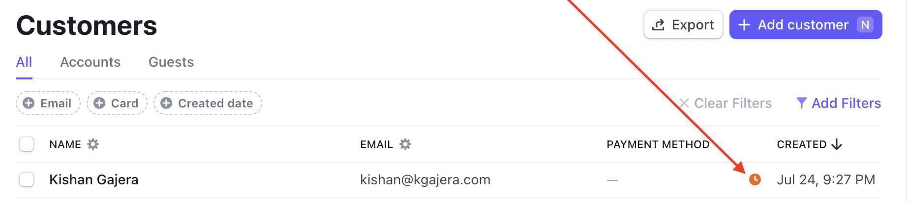
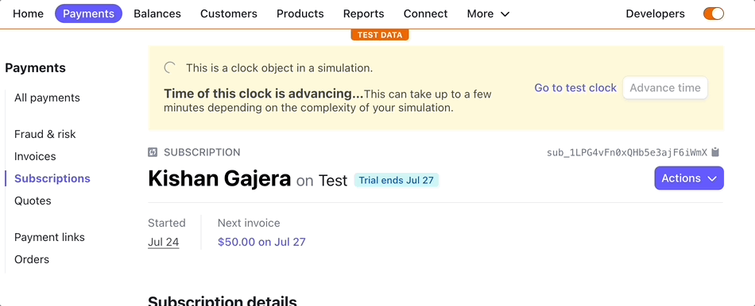

[Stripe](https://stripe.com) supports many different subscription models such as flat fee, metered billing based on usage, and scheduled subscriptions. In any case, testing your subscription through the course of it's lifecycle is crucial before going live. With the help of Stripe's [test clocks](https://stripe.com/docs/billing/testing/test-clocks) feature, this is possible!

<!--truncate-->

At first glance, I found the test clock feature confusing because I was trying to use it through Stripe's dashboard. What's confusing is that you can't attach _any_ customer to a test clock - this association can only be set when [creating the customer](https://stripe.com/docs/api/customers/create) using the [`test_clock`](https://stripe.com/docs/api/customers/create#create_customer-test_clock) parameter. Knowing this, I wouldn't advise using the dashboard for this because you won't be able to simulate scenarios for customer and subscription creation as it would occur through your app. After thinking more about testing strategies, it makes sense to integrate this within your app during the customer creation process.

## Example using Express app

We'll use a minimal [Express](https://expressjs.com) app as an example Stripe integration. In this example or your real world app, the main point of interest is where the customer is being created.

Our app will contain two REST endpoints:

- `POST /users` - this endpoint will create a customer
- `POST /subscriptions` - this endpoint will create a subscription with a 3 day free trial

Browse the Express app implementation below and then we'll recap. You can also find the full source code here: https://github.com/kgajera/javascript-examples/tree/master/examples/express-stripe-test-clock

```ts
import "dotenv/config";
import express from "express";
import Stripe from "stripe";

if (!process.env.STRIPE_SECRET_KEY) {
  throw new Error("STRIPE_SECRET_KEY not set in .env file");
}

export const app = express();
app.use(express.json());

const stripe = new Stripe(process.env.STRIPE_SECRET_KEY, {
  apiVersion: "2020-08-27",
});

/**
 * Endpoint to create a new user/customer.
 */
app.post("/users", async function (req, res) {
  const { name, email } = req.body;
  let testClock: Stripe.TestHelpers.TestClock | null = null;

  // Enable test clock creation using an environment variable
  if (process.env.STRIPE_USE_TEST_CLOCK === "true") {
    // Create a new test clock for each customer (a test clock can only have 3 customers)
    testClock = await stripe.testHelpers.testClocks.create({
      frozen_time: Math.round(Date.now() / 1000), // Current time in seconds
    });
  }

  // Create the customer, optionally with a test clock
  const customer = await stripe.customers.create({
    name,
    email,
    test_clock: testClock?.id,
  });

  res.json(customer);
});

/**
 * Endpoint to create a subscription for a customer
 */
app.post("/subscriptions", async function (req, res) {
  const { customer_id, price_id } = req.body;

  // Create a subscription with a 3 day free trial
  const subscription = await stripe.subscriptions.create({
    customer: customer_id,
    items: [
      {
        price: price_id,
      },
    ],
    trial_period_days: 3,
  });

  res.json(subscription);
});
```

As mentioned before, we need to attach a customer to a test clock when the customer is created. We're doing this in `POST /users` endpoint. Since this functionality is only for testing purposes, we are conditionally enabling it using the `STRIPE_USE_TEST_CLOCK` environment variable. If this variable equals `'true'`, we want to create a new test clock and pass the id of it when creating the customer.

In Stripe's dashboard, customers attached to a test clock with have the following icon:



Once a customer is attached to a test clock, any subscription or subscription schedule created for the customer can be simulated by advancing time on the test clock.

With this implementation, we can test our Stripe subscription by calling these endpoints (through a UI or directly) and then manually advancing the test clock through Stripe's dashboard. After time has been advanced, ensure the subscription's state is what you expect it to be.

For this example, advancing 4 days in the future changes the status from `trialing` to `past_due`:



## Can this be automated?

After getting to this point, my next thought was to automate advancing time through a testing framework like [Jest](https://jestjs.io). I started going down that path and learned that advancing time is not instantaneous. Depending on how complex your test clock scenario is, it can take Stripe an unknown amount of time to run the simulation and the test clock's status will be `advancing` during that time. This makes automating through tests difficult.

While unfortunate, test clocks are still an incredibly useful tool that can give you peace of mind that your subscriptions will work as expected. If you have any feedback or want to share how you're using test clocks, leave a comment below!
