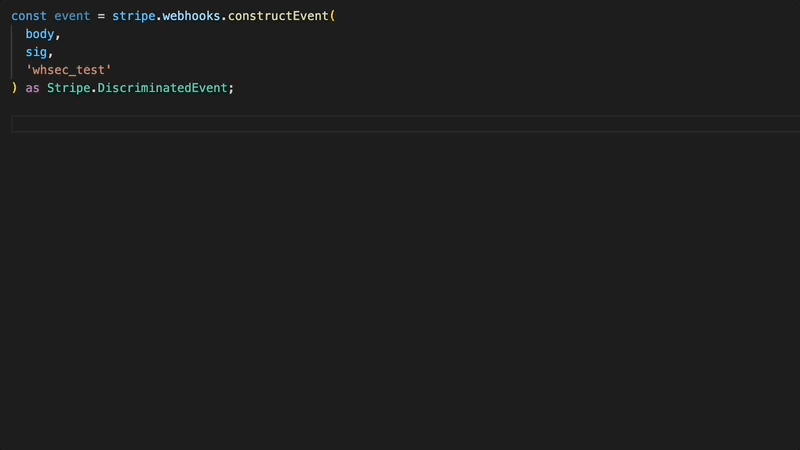

I'm working on a project that relies heavily on [Stripe webhooks](https://stripe.com/docs/webhooks) and while implementing the webhook handler, I noticed the lack of type safety increases the risk of error in my implementation. This could be something simple like misspelling the event name or trying to access the event's `data.object` fields incorrectly. For this reason, I built a way to generate typings for all webhook events to strongly type the event object.

<!--truncate-->

TL;DR: Use the [`stripe-event-types`](https://www.npmjs.com/package/stripe-event-types) package to strongly type your webhook event.

## What's wrong with the `Stripe.Event` type?

The `Event` typings that are included in the [`stripe`](https://github.com/stripe/stripe-node) library have the following shortcomings:

- The `type` field is a `string` type. The `type` field will store the event type name, for example `charge.succeeded`. At the time of writing this, there are 189 different event types. Not only would it improve developer experience, but it would also eliminate spelling errors if the `type` field had a string literal type.
- The `data.object` field is a `{}` type. This requires you to cast to a Stripe resource type each time you want to access a `data.object` field, for example, `event.data.object as Stripe.Customer`.

## Strongly typing the event

With stronger typings, we could take advantage of type checking and type inference, for example:

```ts
// This should result in a type error if type that is enclosed in quotes is not valid
if (event.type === "charge.succeeded") {
  // TypeScript should be able to infer the `object` type because of the `if` condition.
  // In this case, `Stripe.Charge` is the inferred type.
  event.data.object.amount;
}
```

### Creating the types

Creating typings that achieve the result above isn't difficult, but the challenge is how do we create the typings for all 189 events? And then how will we maintain them as changes are made to the Event API? Generate them!

By having a method to generate the types, we can regenerate them in the future as the API changes. So I went searching through Stripe's [OpenAPI specification](https://github.com/stripe/openapi) and docs to find an exhaustive list of event types and also information about the `object` type corresponding to each event type. I found that all this information is located in their Event API docs: https://stripe.com/docs/api/events/types

The image below shows what we need to scrape from each event type listed on their docs page in order to create types for it:


I used [Puppeteer](https://pptr.dev) to programatically navigate to the page, scrape the necessary data using DOM selectors, and then use the scraped data to generate all the typings.

If you're interested in seeing the script, it's located here: https://github.com/kgajera/stripe-event-types/blob/main/scripts/generate.ts

At some point in the future, I may schedule the CI to run the generation script daily to do a diff with the existing typings file to automatically detect changes in their API.

### Using the types

I distributed these typings through the [`stripe-event-types`](https://www.npmjs.com/package/stripe-event-types) NPM package:

```
npm install stripe-event-types
```

When constructing the webhook event, cast it to `Stripe.DiscriminatedEvent` to strongly type the `event.type` and `event.data.object` fields:

```ts
/// <reference types="stripe-event-types" />

const event = stripe.webhooks.constructEvent(
  body,
  sig,
  "whsec_test"
) as Stripe.DiscriminatedEvent;
```

Now when accessing the `event.type` and `event.data.object` we have type checking and type inference!



In the example above, you can see that `event.type` must be a valid event type name, otherwise it will result in a type error. The condition in the `if` statement allows for type inference. In this case, `event.data.object` is inferred to be a `Stripe.Charge` object because the type name will be `charge.captured`.

Thanks for reading and now go implement your webhook handler with more confidence!
