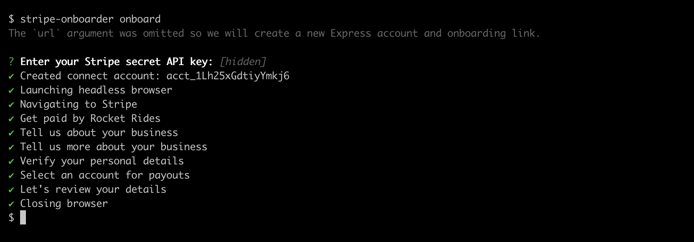
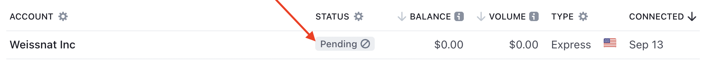
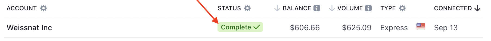

While implementing a [Stripe Connect](https://stripe.com/docs/connect) integration, I repeatedly came across the tedious task of onboarding [Express accounts](https://stripe.com/docs/connect/express-accounts) to test the integration, whether that be manual or automated testing. Creating an Express account using Stripe's API is an easy task, but in order for the account to be verified to accept payments and transfers, the account needs to manually complete [onboarding](https://stripe.com/connect/onboarding) forms on a Stripe hosted page. Let's take a look at how I automated the onboarding process.

<!--truncate-->

I've had an itch to work with [Puppeteer](https://pptr.dev) lately, so that's what I chose to automate the onboarding form submission. If you're not familiar with Puppeteer, it's a library that among many other things, allows you to programatically open a browser, navigate to pages, and use DOM selectors to perform interactactions such as clicking or typing similarly to how a real user would.

I started developing a script using Puppeteer that navigates to Stripe's onboarding URL. Then proceeding to submit each of the onboarding forms with valid data to pass Stripe's [verifications for testing](https://stripe.com/docs/connect/testing). The main challenge in developing this was to account for all the different variations the onboarding forms. Depending on the account's [business type](https://stripe.com/docs/api/accounts/object#account_object-business_type), [capabilities](https://stripe.com/docs/api/accounts/object#account_object-capabilities), and whether an [account link](https://stripe.com/docs/api/account_links) or [OAuth link](https://stripe.com/docs/connect/oauth-express-accounts#step-1:-you-provide-the-oauth-link) is used, the onboarding forms can be presented differently. After some trial and error, the script ended up working well for my use-cases so I published this as a NPM package.

## Introducing the Stripe Onboarder

The [Stripe Onboarder](https://github.com/kgajera/stripe-onboarder) is a tool that can be used to onboard Express accounts through the CLI or programmatically in your code.

Install the package with:

```sh
npm install stripe-onboarder
```

### CLI Usage

Run the command below to create and onboard a new Express account. Check out the [documentation](https://github.com/kgajera/stripe-onboarder#cli-usage) for a full list of arguments and options available.

```sh
stripe-onboarder onboard
```

:::note

If you installed the `stripe-onboarder` package globally or have added the command as a script in your `package.json`, you can use the command above as is, otherwise, run it with `npx`:

```
npx stripe-onboarder onboard
```

:::

You'll be prompted to enter your Stripe secret key and should see the following output:



The command takes around one minute to complete, and once it does, you'll have an onboarded Express account!

:::tip

Set the `STRIPE_SECRET_KEY` environment variable to skip the CLI prompt.

:::

### Programmatic Usage

Use the exported function, `onboard`, to onboard an Express account programmatically within your code. First, you'll need to create an Express account and onboarding link. You can then call the `onboard` function by providing the onboarding link:

```ts
import { onboard } from "stripe-onboarder";

// Create new Express account
const account = await stripe.accounts.create({ type: "express" });

// Create onboarding link (some params not shown for brevity)
const accountLink = await stripe.accountLinks.create({
  account: account.id,
  type: "account_onboarding",
});

// Call the Stripe Onboarder
await onboard({
  headless: false, // Boolean flag for Puppeteer to run browser in headless mode. Defaults to true.
  url: accountLink.url, // Account Link URL for onboarding
  values: {}, // Optional object of onboarding form values to override default values
});
```

:::note

When the `onboard` function promise is resolved, the Connect account's status will be "Pending" which means the account is still being verified by Stripe and cannot accept payments or transfers yet. This can take up to a few minutes to complete.



:::

### Waiting for verifications

There are cases when you might want to immediately wait for the onboarded account's status to change from "Pending" to "Complete". You can poll [retrieving the account](https://stripe.com/docs/api/accounts/retrieve) to check on the status of the account. Here's an example of a function that will do just that:

```ts
async function waitForAccountVerification(accountId: string, timeout = 120000) {
  const intervalLength = 5000; // Poll every 5 seconds

  return new Promise((resolve, reject) => {
    let time = 0;

    // Interval to poll Stripe to check account status
    const interval = setInterval(async () => {
      // To prevent this interval from executing infinitely in the case where the
      // account does not pass verification, a timeout (defaults to 120 seconds) is
      // used to clear the interval
      if (time >= timeout) {
        clearInterval(interval);
        reject();
      }

      // Fetch account from Stripe
      const account = await stripe.accounts.retrieve(accountId);

      // Resolve promise if the account has been verified to accept live charges
      if (account.charges_enabled) {
        clearInterval(interval);
        resolve(account);
      }

      time += intervalLength;
    }, intervalLength);
  });
}
```

When the promise returned by the `waitForAccountVerification` function is resolved, the account's status will now be "Complete" and ready to accept payments:



I hope this helps you automate onboarding Express accounts for seeding data, testing, and other purposes. Feedback and comments welcome below!
