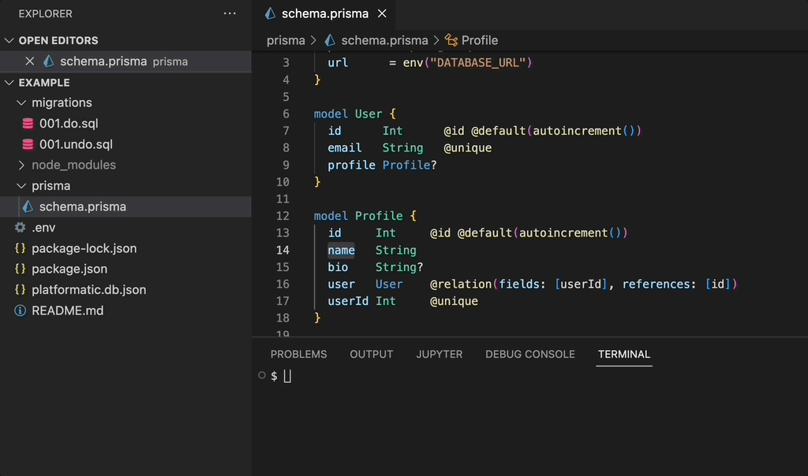

I've spent the past few days experimenting with [Platformatic DB](https://oss.platformatic.dev/docs/reference/db/introduction), a new open-source project that can generate REST and GraphQL APIs from your database. Platformatic's goal is to remove all friction for back-end development. After initializing a new project, the first thing you'll have to do is write SQL migrations. I come from a background of using ORMs such as [Prisma](https://www.prisma.io) where migrations are automatically taken care of for you so it's not something I'm used to doing. I also think writing your own migrations introduces risk for user error like forgetting to create a foreign key. So let's take a look at how we can use a Prisma schema to generate up and down migrations!

<!--truncate-->

TL;DR: Use the [`platformatic-prisma`](https://www.npmjs.com/package/platformatic-prisma) package to generate your migations.

## Migration flow

Before we get started, let's understand what our expected migration flow is. Our goal is to to utilize Prisma to generate SQL migrations scripts, and then leverage all of Platformatic DB's migration features for [storing and applying migrations](https://oss.platformatic.dev/docs/reference/db/migrations).

Prisma provides many features to help you work with databases, but we'll only be leaning on these two features:

- [Prisma schema](https://www.prisma.io/docs/concepts/components/prisma-schema) - configuration file containing data sources and data models
- [prisma migrate diff](https://www.prisma.io/docs/reference/api-reference/command-reference#migrate-diff) - CLI command to generate the up and down SQL migration script

## Prisma schema

The Prisma schema is where all the [data models](https://www.prisma.io/docs/concepts/components/prisma-schema/data-model) are defined. I love how the format of this file makes it easy to read and allows me to view my all my models and relations quickly at a glance. We'll be using the following schema as an example:

```prisma title="prisma/schema.prisma"
datasource db {
  provider = "postgresql"
  url      = env("DATABASE_URL")
}

model User {
  id      Int      @id @default(autoincrement())
  email   String   @unique
  profile Profile?
}

model Profile {
  id     Int     @id @default(autoincrement())
  name   String
  bio    String?
  user   User    @relation(fields: [userId], references: [id])
  userId Int     @unique
}

// Internal table used by Platformatic/Postgrator to manage migrations
model Version {
  version BigInt    @id
  name    String?
  md5     String?
  run_at  DateTime? @db.Timestamptz(6)

  @@map("versions")
  @@ignore
}
```

You should see that this schema has three models, `User`, `Profile` and `Version`, which will map to tables in our database. Each model has fields which will be columns in the model's database table.

:::note
The `Version` model represents the table that Platformatic DB uses internally to manage migrations. It's needed in the Prisma schema so that migrations are not generated for it.
:::

## Generating migration scripts

Using Prisma's CLI, the `prisma migrate diff` command can be used to output the SQL needed for the migration. The necessary migrations are determined by comparing the states of your database and the Prisma schema. The command allows us to specify the "from" and "to" state, so we can generate both the up and down migrations.

To generate the up migration, the "from" state will be the database, and the "to" state will be the Prisma schema:

```sh
prisma migrate diff --from-schema-datasource prisma/schema.prisma --to-schema-datamodel prisma/schema.prisma --script
```

So for example, let's say we want to rename the `name` field to `fullName` in the `Profile` model:

```diff title="prisma/schema.prisma"
-  name      String
+  fullName  String
```

After making this change to the Prisma schema, running the `prisma migrate diff` command would generate the following migration script:

```sql
-- AlterTable
ALTER TABLE "User" DROP COLUMN "name",
ADD COLUMN "fullName" TEXT NOT NULL;
```

This SQL script then needs to be saved in the migrations directory specified in your Platformatic DB's [configuration file](https://oss.platformatic.dev/docs/reference/db/configuration#migrations) with the following naming convention, `001.do.sql`, where "001" is the migration version number that will be incremented for each migration.

Similarly, to generate the down migration, the "from" state will be the Prisma schema, and the "to" state will be the database:

```sh
prisma migrate diff --from-schema-datasource prisma/schema.prisma --to-schema-datamodel prisma/schema.prisma --script
```

The SQL script produced by this command then needs to be saved with the file naming convention, `001.undo.sql`.

## Automate this flow in your project

You might be thinking that was quite a few steps to generate and save the migrations, and you're right, we should write a script to make it easier on ourselves. I've done just that and published it as an NPM package, [`platformatic-prisma`](https://www.npmjs.com/package/platformatic-prisma), that automates the steps outlined in this post.

Anytime a change is made your Prisma schema file, run the following command to generate and save the migrations:

```
npx platformatic-prisma
```

I'll leave you with the demo:


